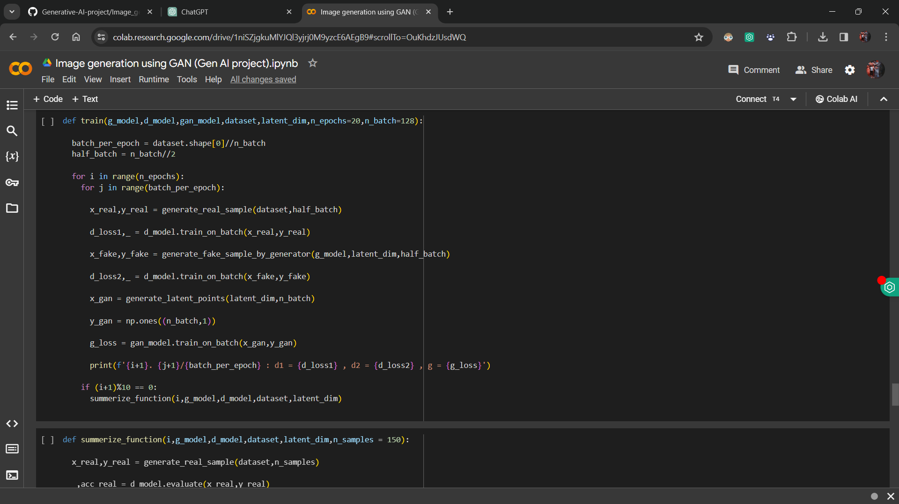
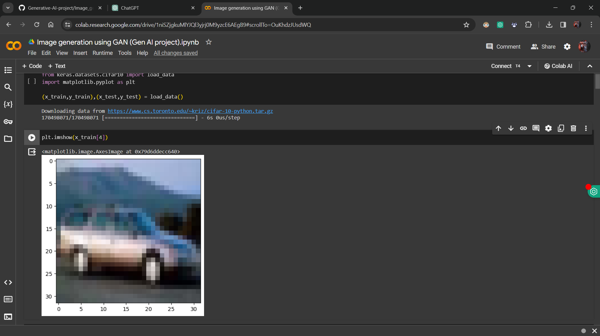
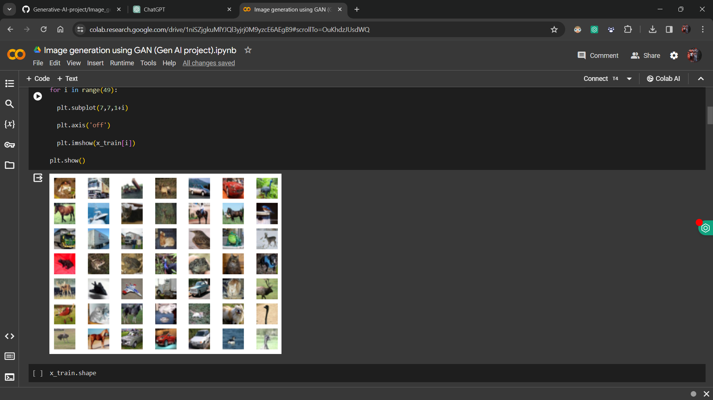

## Gen AI – Image Generation using GAN

A Deep Learning and Generative AI project that uses Generative Adversarial Networks (GANs) to generate realistic synthetic images inspired by the CIFAR-10 dataset. This project demonstrates the implementation of a custom GAN architecture using TensorFlow and Keras, where a Generator creates fake images and a Discriminator learns to distinguish between real and generated images through adversarial training.

## Project Overview

This project focuses on understanding and implementing the core concepts of Generative AI and Deep Learning through GANs.

The system consists of two neural networks:
- Generator – Generates realistic synthetic images from random noise vectors.
- Discriminator – Classifies whether an image is real or generated.

Both networks are trained simultaneously in a competitive manner, enabling the Generator to gradually produce more realistic images over time.

The project is trained on the CIFAR-10 dataset, which contains 60,000 RGB images across 10 different object categories.

## Features
- Custom GAN architecture implementation using TensorFlow & Keras
- Image generation using random latent vectors
- Training on the CIFAR-10 dataset
- Convolutional Neural Network (CNN)-based Discriminator
- Transposed Convolution-based Generator
- Adversarial training workflow
- Visualization of generated images during training
- Compatible with Jupyter Notebook and Google Colab
- GPU-supported training for faster execution

## Technologies Used
- Python
- TensorFlow
- Keras
- NumPy
- Matplotlib
- Jupyter Notebook / Google Colab

## Deep Learning Concepts Covered

This project demonstrates practical implementation of:

- Generative Adversarial Networks (GANs)
- Convolutional Neural Networks (CNNs)
- Image Synthesis
- Latent Space Representation
- Adversarial Learning
- Deep Learning Optimization
- Binary Classification
- Feature Extraction
- Image Upsampling using Conv2DTranspose

## Project Workflow
Random Noise Vector
        ↓
    Generator
        ↓
Generated Fake Image
        ↓
  Discriminator
        ↓
Real or Fake Prediction

## Training Process
1. Load and preprocess CIFAR-10 dataset
2. Build the Discriminator model
3. Build the Generator model
4. Combine both into a GAN architecture
5. Train Discriminator on:
    - Real images
    - Fake generated images
6. Train Generator to fool the Discriminator
7. Repeat training for multiple epochs
8. Generate realistic synthetic images

## Dataset Information
CIFAR-10 Dataset
The project uses the CIFAR-10 dataset containing:

- 60,000 color images
- 10 object categories
- 32×32 image resolution

## Categories Include:
- Airplane
- Automobile
- Bird
- Cat
- Deer
- Dog
- Frog
- Horse
- Ship
- Truck

## Generator Architecture
The Generator network:
- Takes random noise vectors as input
- Learns image patterns
- Generates synthetic CIFAR-like images
## Layers Used
- Dense Layers
- Reshape Layer
- Conv2DTranspose Layers
- LeakyReLU Activation
- Tanh Activation

## Discriminator Architecture
The Discriminator network:
- Receives both real and fake images
- Learns to classify them correctly
## Layers Used
- Conv2D Layers
- LeakyReLU Activation
- Dropout Layers
- Flatten Layer
- Dense + Sigmoid Output Layer

## Applications of GANs
- AI Image Generation
- Data Augmentation
- Deepfake Technology
- AI Art Generation
- Image Enhancement
- Style Transfer
- Super Resolution
- Research in Generative AI

## Results
The GAN model gradually improves image quality during training by learning the distribution of real CIFAR-10 images. Generated outputs become increasingly realistic as adversarial learning progresses.

The project also visualizes generated outputs at different training stages for performance evaluation.

## Screenshots

